**HiTopo**

**V1.2 Readme**

TopoData provides data acquisition and storage capabilities for the industrial automation sector, along with data read/write interfaces for third-party software, aiming to help system integrators bridge the communication gap between IT and OT.

This is a open project, welcome programers take part in this project to develop new features.

The outstanding features of TopoData software are as follows:

- Supports Siemens Profinet 、Modbus TCP and OPC UA protocol for communication with devices.
- Provides HTTP WebAPI interfaces for IT systems to read and write PLC or device data.
- Offers system diagnostics functionality, allowing engineers to view PLC communication status, read/write data, and download recipe parameters.
- Provides relational database data storage functionality with a flexible storage mechanism; data storage triggering conditions can be configured as cyclic storage, event-based storage, or expression-based storage.
- Flexible definition of binding relationships between database table structures and communication points; engineers do not need to understand SQL statements, as the system can generate database table structures with one click.
- Database support includes three options: Microsoft SQL Server, SQLite, and PostgreSQL.
- Provides flexible recipe definition functionality, allowing users to select different recipes and download recipe parameters to PLCs or devices.
- Historical data can be exported to Excel.
- HMI Data acquisition and storage models for industry software engineers.
- Project import and export function.

# 1 **Installation**

## 1.1 **Installation Environment**

- The software is compatible with Windows 7 and above operating systems.
- The software is developed based on DotNet 8. Therefore, before using it, the following components need to be installed:

- windowsdesktop-runtime-8.0.11-win-x64.exe
- dotnet-runtime-8.0.11-win-x64.exe
- aspnetcore-runtime-8.0.11-win-x64.exe

# 2 **System configuration**

## 2.1 **WebAPI Configuration**

Third-party IT software can access real-time data of the data acquisition channel through the HTTP WebAPI and also perform write operations.

## 2.2 **Database configuration**

- Database Type: A drop-down list of database types, allowing you to select the type of database to store, including Microsoft SQL Server, PostgreSQL, and MySQL.
- Database keep Time: In months, with a minimum of 1 month. Data older than this period will be automatically deleted by the service software, and only data within this period will be retained.
- SQL Host: The address of the server where the database is located.
- Database: The name of the database.
- Database Storage Location: Only useful when creating an SQL Server database. For PostgreSQL and MySQL, refer to the corresponding manual for data storage locations. Users select a folder and click the "DB Create" button to create the database (if a remote database is configured, users need to create the same folder structure locally and remotely when selecting. If a local location is selected, the remote database will be stored in the corresponding location).
- Username: The database user.
- Password: The database login password.
- Port: The database port.
- Local Log: Logs will be stored in the Logs folder and are mainly used for software debugging or finding system bugs. It is disabled by default.
- Create DB Button: Create the database based on account, password, port, and other information.
- Test DB Button: Test the database connection status based on the configuration.
- Save Button: Save configuration.

## 2.3 **Automatic Start**

By creating shortcuts in the startup folder, the software can be made to start automatically upon windows booting.

# 3 **Equipment Management**

## 3.1 **Simens Profinet Equipment**

User select “Siemens Profinet” Driver Type, this driver provides communication functionality with Siemens S7-300/400 and S7-1200/1500 PLCs.

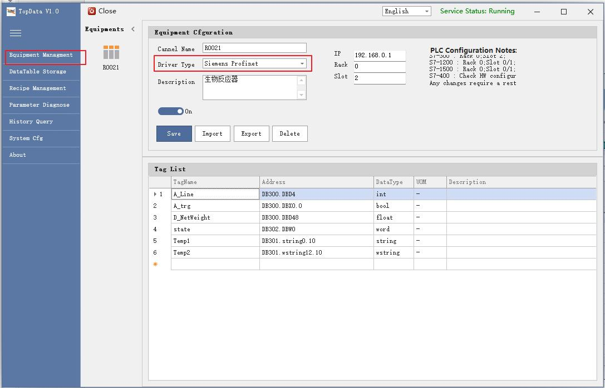

- Special Settings for S7-1200 and S7-1500 in TIA Portal Software

- The CPU must be configured to allow PUT/GET communication access from remote partners (the interface is similar to the following).

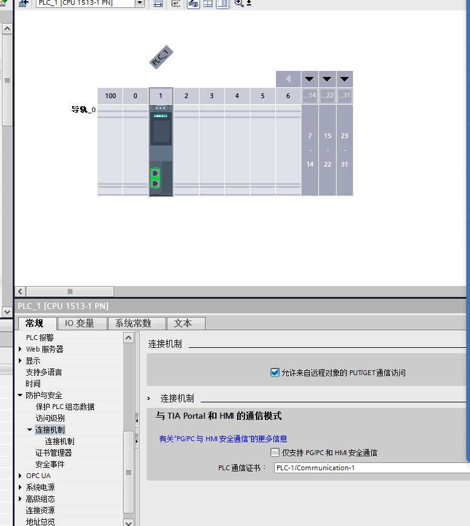

- If you need to access DB blocks, the DB blocks must be configured for non-optimized address access:

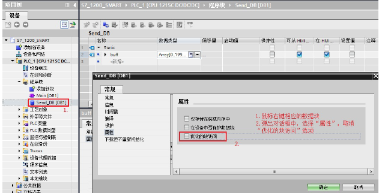

- 配置点表

TopoData suportated：

<table><tr><td>
num
</td><td>
TopoData DataType
</td><td>
TIA DataType
</td><td>
Descirption
</td></tr><tr><td>
1
</td><td>
Int
</td><td>
Dint
</td><td></td></tr><tr><td>
2
</td><td>
Bool
</td><td>
Bool
</td><td>
boolean
</td></tr><tr><td>
3
</td><td>
Float
</td><td>
Float32
</td><td>
Float 32
</td></tr><tr><td>
4
</td><td>
String
</td><td>
String
</td><td>
string
</td></tr><tr><td>
5
</td><td>
Wstring
</td><td>
Wstring
</td><td>
Unicode string
</td></tr><tr><td>
6
</td><td>
WORD
</td><td>
WORD
</td><td>
int 16
</td></tr></table>

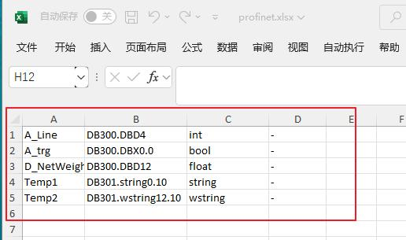

As shown in the figure below, TopoData supports configuring the point table via Excel import and export. The first column is the variable name, which will be used later for database storage and external interfaces; the second column is the PLC point address (the address naming is the same as in TIA Portal, e.g., DB301.wstring12.10, where 301 is the DB block number, 12 is the absolute address of the string, and 10 is the string length); the third column is the data type; the fourth column is the unit of the point (if no unit is required, use another character as a placeholder, preferably not left blank); the fifth column is the remark or description of the variable name.

*Notes:*

- *For the first-time configuration, users can click the "Export" button. The software provides a sample address format, which users can edit based on, then import and save.*
- *To improve communication efficiency, it is recommended to place data communication points in one or as few DB blocks as possible, with data locations as adjacent as possible.*
- *The current driver only supports read/write operations for DB blocks; other memory areas are not supported at this time.*
- *Bool-type data does not support write operations.*

## 3.2 **OPC UA Equipment**

User select “OPCUA” Driver Type, this driver provides communication functionality with devices via OPC UA communication type.

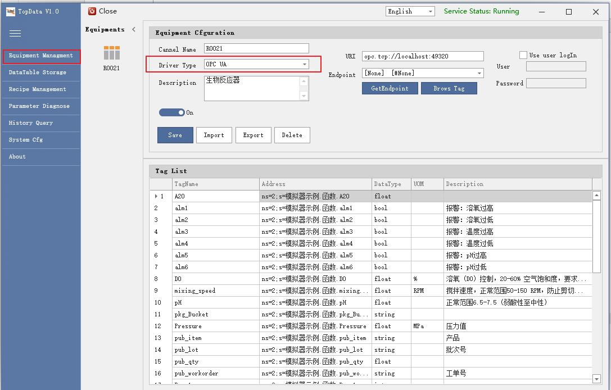

- "Get Endpoint" button: After correctly filling in the URL, click the "Get Endpoint" button. The system will enumerate all Endpoints. The user selects one and clicks the "Save" button to save it.
- The "Brows Tag" button: A dialog box pops up for selection. Right-click on the parent node and select "Get all subItems" from the context menu to add sub-level all Tags, or select the yellow icon node individually and choose "Get this item" to add the current OPC UA Tag.

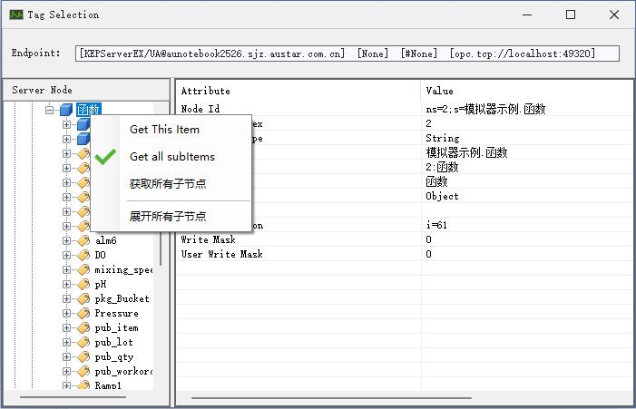

- Import and export tags

As shown in the figure below, TopoData also supports configuring the point table through Excel import and export. The first column is the variable name, which will be used later for database storage and external interfaces; the second column is the UA point address (must start with "ns"); the third column is the unit of the point (if no unit is required, use another character as a placeholder, preferably not left blank); the fourth column is the remark or description of the variable name.

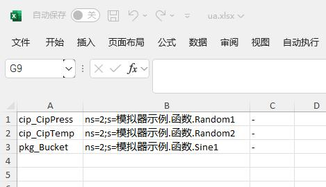

*Note：*

- *For the first time, users can click the "Export" button. The software will provide an example address format, which users can edit based on, then import and save.*
- *The "On-Off switch" allows users to enable or disable the device communication function.*

## 3.3 **Modbus TCP Equipment**

User select “Modbus TCP” Driver Type, this driver provides communication functionality with devices via Modbus TCP communication type.

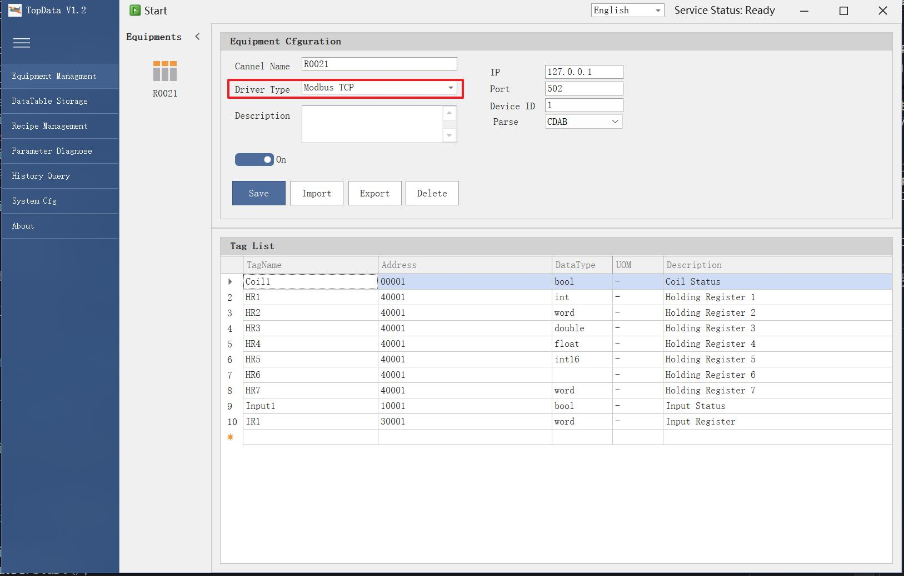

Modbus TCP includes following address formats：

- Holding register：

Data address type： 4xxxxx

Read/Write: Read and write

Data Type：

<table><tr><td>
num
</td><td>
DataType
</td><td>
Longth(byte)
</td></tr><tr><td>
1
</td><td>
Int
</td><td>
4
</td></tr><tr><td>
2
</td><td>
Int64
</td><td>
8
</td></tr><tr><td>
3
</td><td>
Word
</td><td>
2
</td></tr><tr><td>
4
</td><td>
Int16
</td><td>
2
</td></tr><tr><td>
5
</td><td>
Float
</td><td>
4
</td></tr><tr><td>
6
</td><td>
Double
</td><td>
8
</td></tr></table>

- Input register：

Data address type： 3xxxxx

Read/Write: Read only

Data Type：

<table><tr><td>
num
</td><td>
DataType
</td><td>
Longth(byte)
</td></tr><tr><td>
1
</td><td>
Int
</td><td>
4
</td></tr><tr><td>
2
</td><td>
Int64
</td><td>
8
</td></tr><tr><td>
3
</td><td>
Word
</td><td>
2
</td></tr><tr><td>
4
</td><td>
Int16
</td><td>
2
</td></tr><tr><td>
5
</td><td>
Float
</td><td>
4
</td></tr><tr><td>
6
</td><td>
Double
</td><td>
8
</td></tr></table>

- Coil ：

Data address type： 0xxxxx

Data Type：bool

Read/Write: Read only

- Input：

Data address type： 1xxxxx

Data Type：bool

Read/Write: Read only

# 4 **DataTable storage**

This functional module is mainly used for data storage configuration. Users can utilize a fixed database table structure or create their own, bind corresponding PLC communication points, and store the data.

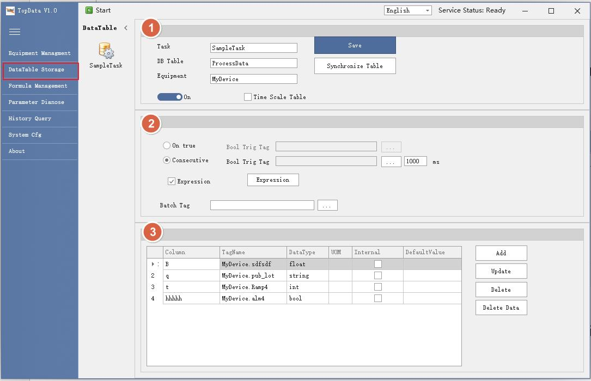

- Storage Information

Task: Storage Task

DB Table: user defined Database table name

Equipment: equipment name

Switch button: enable or disable database storage

Time scale table checkbox: If this option is not selected, data will be stored in the user-defined table structure, with the table name taken from the "DB Table" text box; if this option is selected, data will be stored in the table "tb\_au\_pubHisvalues".

- 数据存储规则

Consecutive Acquisition: As shown in the figure below, select the " Consecutive Acquisition" radio button to enable the system to continuously collect data according to the acquisition cycle. Users need to fill in the acquisition cycle and a bool-type trigger condition data acquisition point. When the bool value is true, the software performs table data storage; when false, the system does not store data.

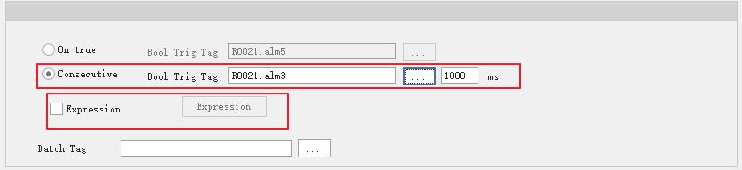

To achieve more complex acquisition and storage rules, please check the " Expression" checkbox, click the "Expression" button, and a dialog box will pop up for configuring the expression conditions.

Rising Edge Acquisition: As shown in the figure below, select the "Rising Edge Acquisition" radio button to enable table data storage when the system detects a bool value of On/True. Users need to configure a bool-type trigger condition point.

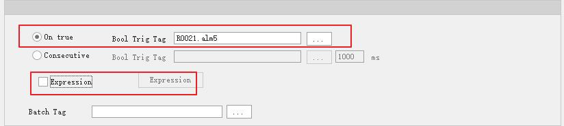

To achieve more complex acquisition and storage rules, please check the " Expression" checkbox, click the "Expression" button, and a dialog box will pop up for configuring the expression conditions.

Use Expression: Expressions can be used in both Rising Edge and Continuous Acquisition modes. An expression is a formula that combines multiple variable conditions to determine the data storage condition.

Users check the " Expression" checkbox and click the "Expression" button to pop up the Expression Editor dialog. First, users click the plus button to the right of the parameter list in the middle to add one or more internal variables for the expression. Then, edit the expression in the expression text box, click the red checkmark button to verify if the expression is correct. If correct, click the Save button to save the expression.

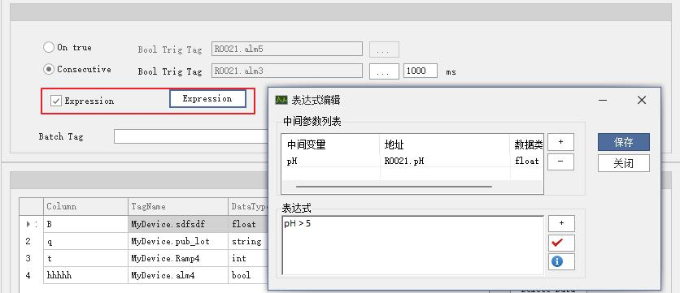

- Data Collection

As shown in the figure below, users can custom-configure the storage data table structure, where each data column corresponds to a device communication point. The system stores a set of real-time data into this table according to the acquisition rules configured above.

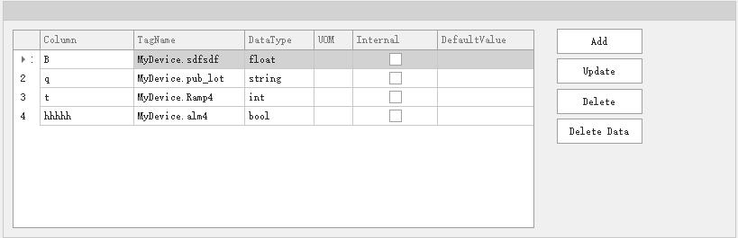

- Batch Tag

This configuration is optional. If a batch number communication point is configured, the system will assign work order (WO) information to the corresponding reserved WO field in the table based on this point. This communication point must be in string format.

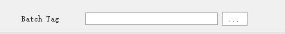

# 5 **Recipe Management**

Users can define multiple sets of recipe download parameters, where each recipe can define different download parameters as well as different default values.

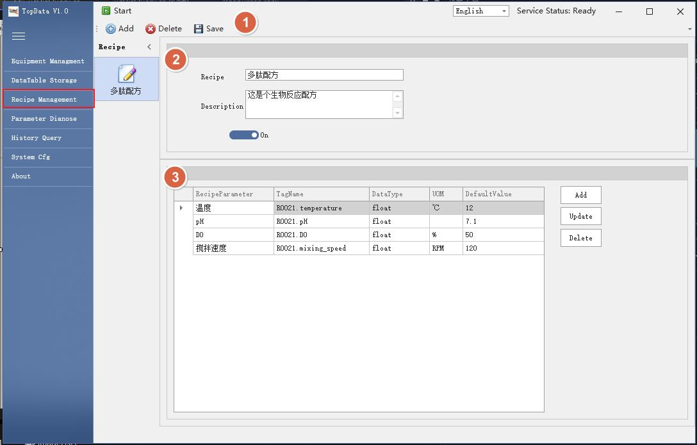

## 5.1 **Button action**

Add，Delete and Save configuration buttons.

## 5.2 **Basic information**

Recipe name and description define as well as enable configuration.

## 5.3 **Recipe parameters**

Table for recipe parameters as well as configuration buttons.

# 6 **Parameter Diagnose**

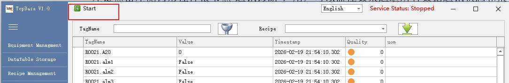

If all modules have been correctly configured according to the requirements in Chapters 3, 4, and 5, click the 'Start' button at the top to switch to the 'Parameter Diagnose' module for real-time monitoring and operation of the equipment.

- The module provides filtering functionality by TagName.
- The module provides recipe parameter download functionality.
- Double-click the communication point to pop up a dialog box, where users can enter the value they want to write and send it to the controller.

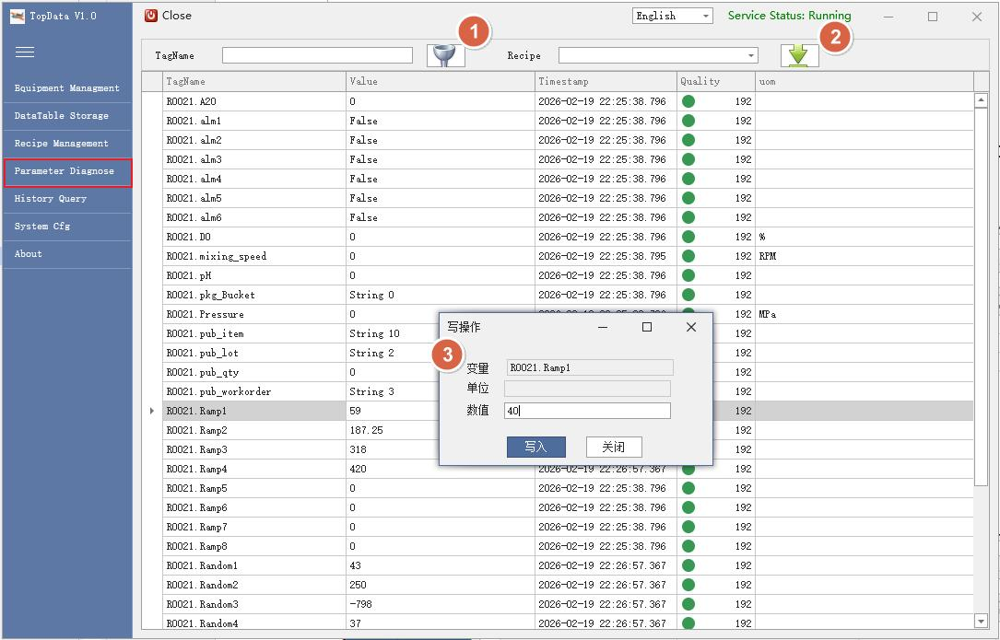

# 7 **Historian query**

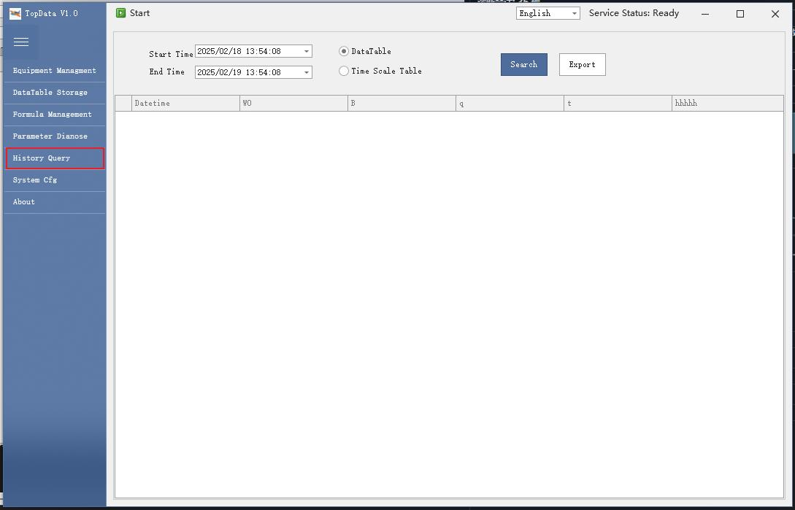

Data stored in the relational database can be queried through the Historical Query module and exported to Excel.

If 'DataTable' is selected, the queried data comes from the database table 'ProcessData' configured in Chapter 5; if 'Time Scale Table' is selected, the queried data comes from the database table 'tb\_au\_pubHisvalues'.

# 8 **WebAPI Read and Write**

If external WebAPI interface functionality is required, the WebAPI service address must first be configured in Section 4.1

## 8.1 **WebAPI TagName**

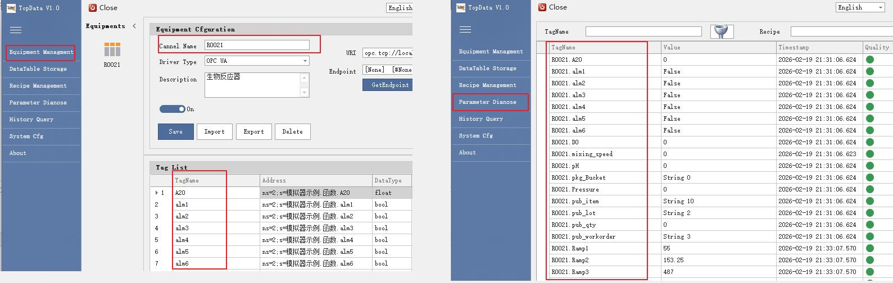

In the WebAPI and Parameter Diagnostics modules, the TagName is equivalent to 'Data Acquisition Channel + Point Name' in the Device Management module.

## 8.2 **Read Tags**

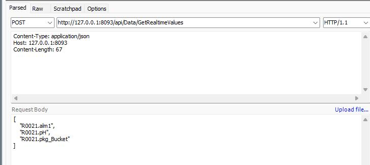

WebAPI Post：

[http://127.0.0.1:8093/api/Data/GetRealtimeValues](http://127.0.0.1:8093/api/Data/GetRealtimeValues)

Content-Type: application/json

The input parameter is a JSON string array.：

Request Body:

[

"R0021.alm1",

"R0021.pH",

"R0021.pkg\_Bucket"

]

## 8.3 **Write Tags**

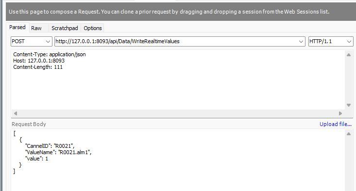

WebAPI Post：

[http://127.0.0.1:8093/api/Data/WriteRealtimeValues](http://127.0.0.1:8093/api/Data/WriteRealtimeValues)

Content-Type: application/json

The input parameter is a JSON string array.

Request Body:

[

{

"CannelID": "R0021",

"ValueName": "R0021.alm1",

"value": 1

}

]

## 8.4 **Download Recipe**

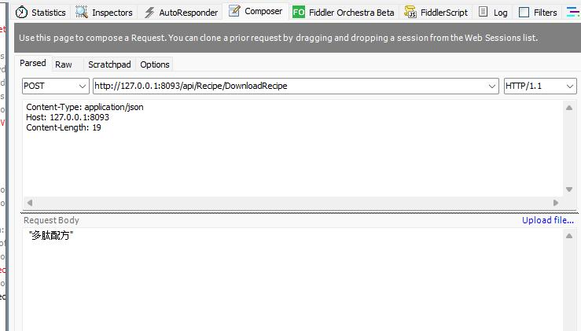

WebAPI Post：

[http://127.0.0.1:8093/api/Recipe/DownloadRecipe](http://127.0.0.1:8093/api/Recipe/DownloadRecipe)

Content-Type: application/json

The input parameter is a JSON string array.

Request Body:

"多肽配方"

# 9 **License**

MIT License

Copyright (c) [2026] [Topotech Team]

Permission is hereby granted, free of charge, to any person obtaining a copy

of this software and associated documentation files (the "Software"), to deal

in the Software without restriction, including without limitation the rights

to use, copy, modify, merge, publish, distribute, sublicense, and/or sell

copies of the Software, and to permit persons to whom the Software is

furnished to do so, subject to the following conditions:

The above copyright notice and this permission notice shall be included in all

copies or substantial portions of the Software.

THE SOFTWARE IS PROVIDED "AS IS", WITHOUT WARRANTY OF ANY KIND, EXPRESS OR

IMPLIED, INCLUDING BUT NOT LIMITED TO THE WARRANTIES OF MERCHANTABILITY,

FITNESS FOR A PARTICULAR PURPOSE AND NONINFRINGEMENT. IN NO EVENT SHALL THE

AUTHORS OR COPYRIGHT HOLDERS BE LIABLE FOR ANY CLAIM, DAMAGES OR OTHER

LIABILITY, WHETHER IN AN ACTION OF CONTRACT, TORT OR OTHERWISE, ARISING FROM,

OUT OF OR IN CONNECTION WITH THE SOFTWARE OR THE USE OR OTHER DEALINGS IN THE

SOFTWARE.
